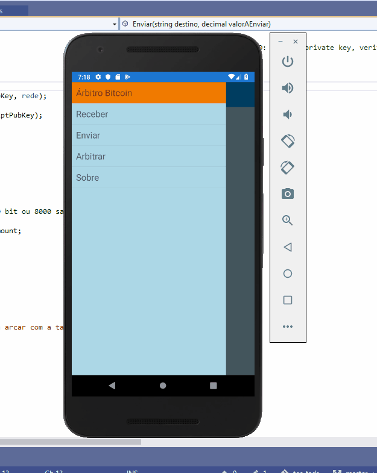

# Árbitro Bitcoin

[English](docs/README-en.md)

Aplicativo multiplataforma para criação, modificação e divulgação de transações com Bitcoins, utilizando multi-assinaturas, envolvendo um árbitro na transação para resolução de conflitos. 

Este app tem as funcionalidade de consulta e exibição de saldo de um determinado endereço do blockchain Bitcoin, criação de endereço de recebimento, criação de endereço de recebimento arbitrado, criação de transações comuns e divulgação de transação. O objetivo dete trabalho é o delineamento de um processo para viabilizar negociações arbitradas com criptomoedas em plataforma móvel, através de transações multi-assinaturas.

