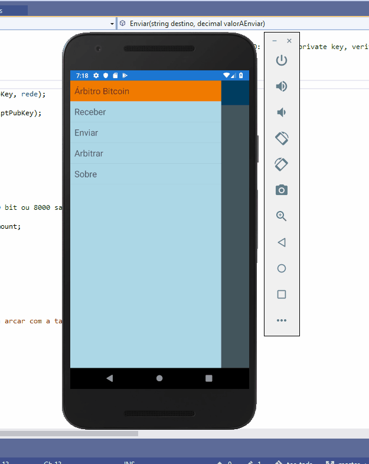
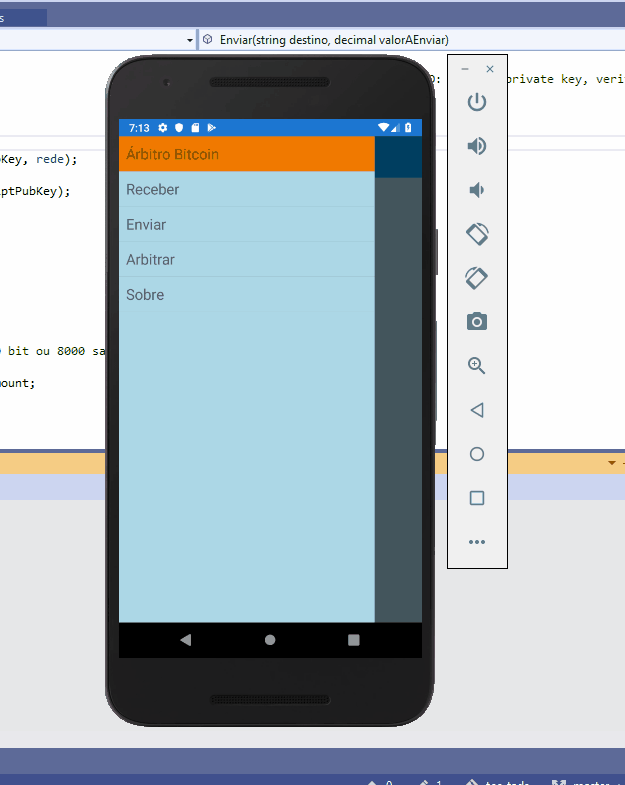

# Árbitro Bitcoin

[Português](../readme.md)

Multi-platform app to create, modify, and broadcast transaction, using multi-signature, involving an arbitrator on the transaction to solve conflicts.

This app have the functionalities to query and exibit the balance of a determined adress of Bitcoin blockchain, creation of receiving adress 
with arbitrator, criation of common transactions and broadcast of the transaction.
The objective of this work is the  design of a process to viabilize arbitrated negociations with criptocurrencies in a mobile platform, through multi-signature transactions.

